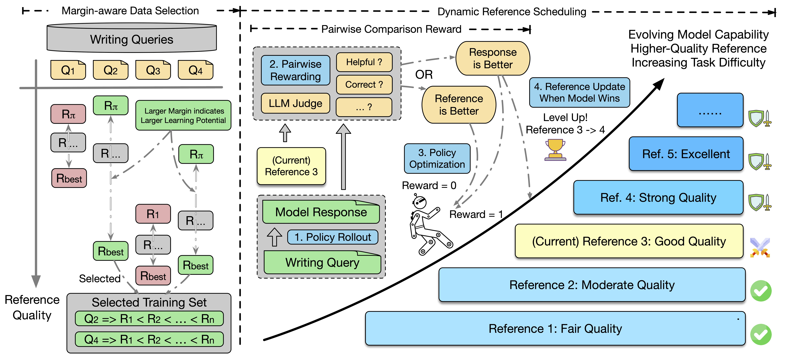
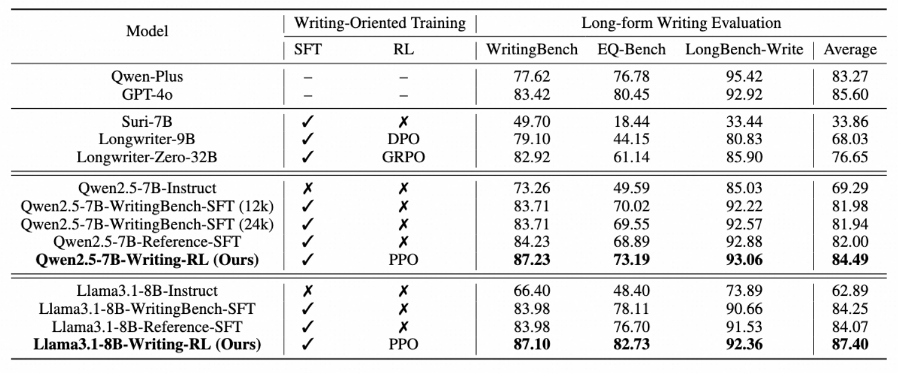
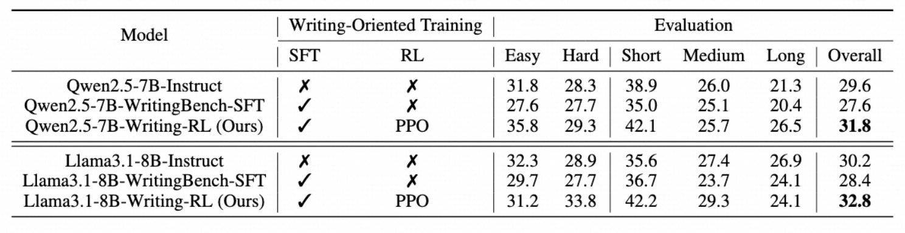

# Writing-RL: Advancing Long-form Writing via Adaptive Curriculum Reinforcement Learning

## ✨ Overview

We present **Writing-RL**: an *Adaptive Curriculum Reinforcement Learning* framework to **advance long-form writing capabilities** beyond traditional supervised fine-tuning (SFT) approaches. 



The Writing-RL framework consists of three key components: 
* *Margin-aware Data Selection* strategy: prioritizes samples with high learning potential
* *Pairwise Comparison Reward* mechanism: provides discriminative learning signals in the absence of verifiable rewards
* *Dynamic Reference Scheduling* approach: adaptively adjusting task difficulty based on evolving model performance.

**💫 Advancing Long-form Writing Capabilities**: Our resulting writer models show that our RL framework largely improves long-form writing performance over strong SFT baselines.

**💫 Generalization from Long-Output to Long-Input**: We observe that models trained with long-output RL generalize surprisingly well to long-input reasoning tasks, potentially offering a promising perspective for rethinking long-context training.

## 🔥 Updates

[2025.09.18] 🌟 We are delighted to release the training [code](https://github.com/Tongyi-Zhiwen/Writing-RL) of our paper. The training dataset and the resulting writer models are coming soon. Stay tuned!
[2025.06.06] 🌟 Our initial paper is available in [Arxiv](https://arxiv.org/abs/2506.05760).

## Methods

### 📊 Margin-aware Data Selection

> **Intuition** 🧩: Samples with higher learning potential enhances learning efficiency.

We propose *Margin-aware Data Selection*, a method that prioritizes training samples with high *learning potential*. In our view, an estimate of sample-wise learning potential is defined as the performance gap between the policy model’s response and the best response from a set of competitive LLMs. Afterwards, we use this metric for sample selection.

### ⚖️ Pairwise Comparison Reward

> **Intuition** 🧩: For writing, it is easier to evaluate response quality when comparing with references.

We introduce *Pairwise Comparison Reward* that leverages LLM-as-a-Judge to provide discriminative, reference-based feedback for long-form writing. Instead of relying on noisy pointwise scores, our reward function compares the policy’s response against a high-quality reference: it awards 1 if the response is judged superior, 0.5 for equivalence, and 0 if inferior. 

### ⏱️ Dynamic Reference Scheduling

> **Intuition** 🧩: We aim to increasingly challenge the model as it evolves.

We propose *Dynamic Reference Scheduling*, a curriculum learning strategy that adaptively escalates task difficulty by progressively replacing defeated references with stronger ones during training. As the policy improves and wins pairwise comparisons against its current reference, it “levels up” to a marginally harder one, creating a personalized, asynchronous learning path per sample. This eliminates static difficulty assumptions and inference overhead while continuously aligning challenge with model capability, driving steady improvement without overwhelming the learner.

## 🚀 Experiments

### 🏆 Long-form Writing 

Our Writing-RL trained models exhibit long-form writing capabilities that match or even surpass those of proprietary models, positioning them as strong open-source alternatives for long-form generation tasks.



### ⚡ Long-input Reasoning

Our Writing-RL trained models exhibit surprising generalization to long-context reasoning tasks with substantially longer inputs (evaluated on LongBench v2), while the SFT-trained counterparts show slight performance degradation in this regime. (Training input + output: 1k - 8k; Evaluation input: 8k - 2M)



## 🎮 Training Models

### 🔄 Environment Setup

```
conda create -n verl python==3.10 -y
conda activate verl

pip3 install torch==2.6.0
pip3 install flash-attn==2.7.4.post1 --no-build-isolation

pip3 install -e .

pip3 install vllm==0.8.2
```

For more specific environment issues, you can refer to [VeRL](https://github.com/volcengine/verl) and [TinyZero](https://github.com/Jiayi-Pan/TinyZero).

### 📚 Data Preparation

The training dataset should be placed in `data` directory, consists of `train.parquet` and `test.parquet`. The training samples should be in the following format:

```
{
    'data_source': 'writing',
    'prompt': [
        {
            'content': "You are a helpful assistant.",
            'role': "system"
        },
        {
            'content': prompt[str],
            'role': 'user'
        }
    ],
    'ability': 'write',
    'reward_model': {
        'ground_truth': { ### the ground truth is used for constructing judge prompt
            'prompt': prompt[str],
            'target': references[list[str]], ### pre-generated list of references with increasing quality
            'criteria': criteria[str], ### could be None
            'id': id[int] ### id should be an integer range(0, len(references)), indicating the index of current reference, increasing during training process.
        },
        'style': 'rule'
    },
    'extra_info': {
        'index': id,
        'split': train ### 
    }
}
```

Our training dataset will be available soon, stay tuned!

### 🎯 Model Preparation

We recommend using a stronger writer model as the RL base model, such as [Writing-Model-Qwen-7b](https://huggingface.co/AQuarterMile/Writing-Model-Qwen-7B).

### 🤖 Model Training

We include the environment configurations and the training commands in `scripts/train_writing_rl.sh`. Most configurations are similar with the original VeRL config and you can adjust them based on your hardware conditions. We would like to elaborate on some critical parameters introduced by our framework.

#### API Configurations

Since we use pairwise LLM-as-Judge methods to provide rewards, we implement a [ParallelRewardManager](verl/workers/reward_manager/parallel.py) to call LLM APIs in parallel after completing rollouts of a batch. The writing-oriented reward function is implemented in [compute_score](verl/utils/reward_score/writing_rl.py) and the judging prompts are included in [judging_prompts](verl/utils/reward_score/judge_prompts.py). You can customize them to meet your needs.

In the training scripts, you can adjust the following environment variables.

* JUDGE_MODEL: the name of the judge model. In our experiments, we use qwen-plus to balance performance and costs. NOTE: the training process can be costly.
* DASHSCOPE_API_KEY: your dashscope api key here when using qwen models as judge model.
* OPENAI_API_KEY: your openai api key here when using gpt models as judge model.
* REWARD_STRATEGY: should be chosen from `position-disadvantage` or `position-advantage`. As shown in [previous work](https://arxiv.org/abs/2306.05685), the pairwise LLM-Judge has certain level of positional bias (mainly favors the former response). 
  * **position-disadvantage**: When tuning stronger writer models, we recommend to set it as `position-disadvantage` to place the model answer as the latter response in the comparison and introduce more pressure for the policy model. In this configuration, the reward function is `LLM-Judge(reference, model response)`.
  * **position-advantage**: When tuning less competent writer models, we recommend to set it as `position-advantage` to place the model answer as the former response in the comparison and let the model receive more positive reward signals. In this configuration, the reward function is `LLM-Judge(model response, reference)`.
* API_PARALLEL: the parallel rate of judge model api and you need to adjust it based on your api rate limit.

#### Other Tips

* We recommend use wandb to log your experiments and you need to configure your wandb api key in the script.
* To dynamically monitor the current reference indexes of each training sample, we first execute `scripts/create_index_file.py` to create `index_{experiment_name}.json` in the `running_file` directory. The file contains a mapping of `sample_id` to `current_reference_index` and it will be modified in each trainning step. At the begining of reward computation, the program will read the file to find the current index of the questions and use `reference_list[current_reference_index]` for each sample to construct pairwise comparisons. Afterwards, when some of the model responses beat the current reference, the corresponding `current_reference_index` will add 1 (step towards a better reference) and is finally written to the file. In this way, we implement our `Dynamic Reference Scheduling` framework and we use an external file to log the information to maintain minimal invasive modifications to the original VeRL codebase and can be beneficial for intermediate checking and mannual intervention.

#### Launch Training

After the preparations, you can launch the traning process by our one-stop script.

```
bash scripts/train_writing_rl.sh
```

## 🎓 Acknowledgements

We would like to thank [Deepseek R1](https://arxiv.org/abs/2501.12948), [VeRL](https://github.com/volcengine/verl), [TinyZero](https://github.com/Jiayi-Pan/TinyZero) projects for early explorations in LLM RL and [vllm](https://github.com/vllm-project/vllm) for their infra suppot. We also thank [Qwen](https://github.com/QwenLM/Qwen) and [LLaMa](https://github.com/meta-llama/llama) models to provide a strong foundation for our experiments.


## 📋 Citation
If you find our work helpful, please consider citing our work.

```
@article{lei2025writing,
  title={Writing-RL: Advancing Long-form Writing via Adaptive Curriculum Reinforcement Learning},
  author={Lei, Xuanyu and Li, Chenliang and Wu, Yuning and Liu, Kaiming and Shen, Weizhou and Li, Peng and Yan, Ming and Zhang, Ji and Huang, Fei and Liu, Yang},
  journal={arXiv preprint arXiv:2506.05760},
  year={2025}
}
```


